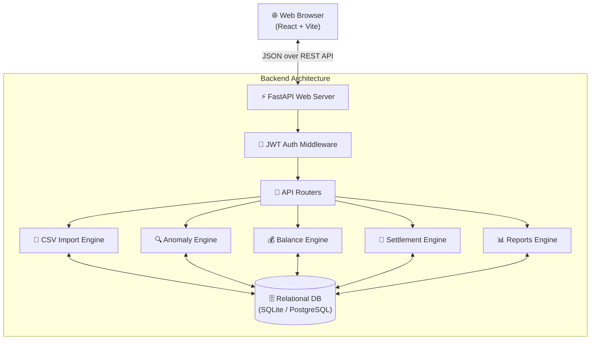
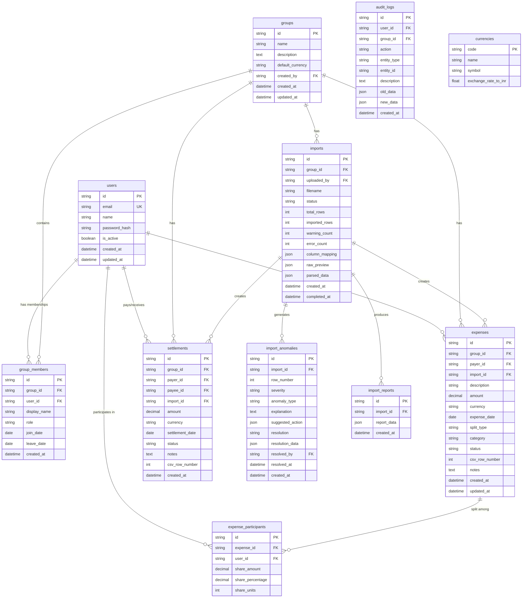
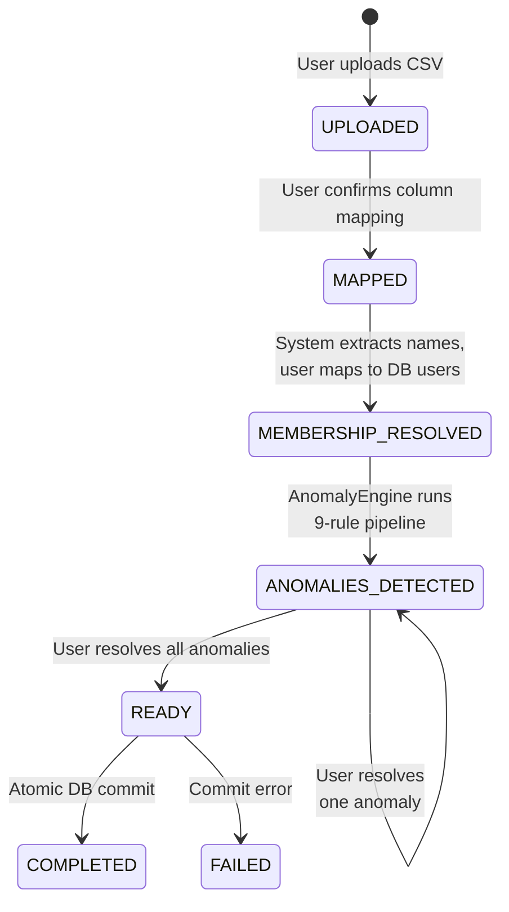

<p align="center">
  <h1 align="center">💰 BalanceIQ</h1>
  <p align="center">
    <strong>Transform messy expense spreadsheets into trustworthy, explainable balances.</strong>
  </p>
  <p align="center">
    <a href="https://github.com/sushantkumar143/BalanceIQ---Expence-Tracker/actions/workflows/ci.yml">
      
    </a>
    
    
    
    
    
  </p>
</p>

---

BalanceIQ is a **production-grade Shared Expense Management SaaS application**. Unlike basic expense splitters, BalanceIQ features a powerful **CSV Import & Anomaly Resolution Engine** designed to handle messy real-world data — duplicate entries, ambiguous dates, mixed currencies, and shifting group membership — while computationally explaining every single decision and balance derivation.

## 📑 Table of Contents

- [🌟 Key Features](#-key-features)
- [💻 Tech Stack](#-tech-stack)
- [🏗️ System Architecture (HLD)](#️-system-architecture-hld)
- [⚙️ Low-Level Design (LLD)](#️-low-level-design-lld)
- [🗄️ Database Schema](#️-database-schema)
- [🔄 Import Workflow State Machine](#-import-workflow-state-machine)
- [🚀 Setup & Local Development](#-setup--local-development)
- [🐋 Docker Deployment](#-docker-deployment)
- [📋 Assignment Documentation](#-assignment-documentation)

---

## 🌟 Key Features

| # | Feature | Description |
|---|---------|-------------|
| 1 | **Smart CSV Import Engine** | Upload raw, messy spreadsheets. The system automatically maps columns using fuzzy matching and handles structural inconsistencies. |
| 2 | **Intelligent Anomaly Detection** | A 9-stage pipeline catches duplicates, negative amounts, mixed currencies, missing members, and settlement misclassifications before they corrupt the ledger. |
| 3 | **Full Mathematical Transparency** | Users never ask *"Why do I owe this?"* Every balance is fully auditable, exposing exact fractions and expense timelines that derive the final number. |
| 4 | **Membership Timeline Logic** | Handles dynamic groups where members join late or leave early. Expenses are split only among active members at the time of the expense. |
| 5 | **Smart Settlement Optimization** | Graph-reduction algorithms minimize the total number of transactions needed to settle all debts within a group. |
| 6 | **Multi-Currency Support** | Handles mixed INR/USD expenses with configurable exchange rates, preventing silent currency mismatches. |
| 7 | **Interactive Analytics Dashboard** | Rich graphical visualizations including monthly trends, category breakdowns, and member contribution charts (powered by Recharts). |
| 8 | **Professional SaaS UI** | A stunning, responsive UI featuring Framer Motion animations, clean light theme with glass-card design, and instant UX feedback. |

---

## 💻 Tech Stack

### Frontend
| Technology | Purpose |
|-----------|---------|
| **React 18** + **Vite** | Fast, modern frontend framework with HMR |
| **TypeScript** | Type safety across the entire UI codebase |
| **Tailwind CSS** | Utility-first CSS with custom glass-card components |
| **Framer Motion** | Micro-animations and page transitions |
| **TanStack React Query** | Server-state caching, synchronization, and background refresh |
| **Recharts** | Data visualization (Line, Bar, Pie charts) |
| **Lucide React** | Beautiful, consistent iconography |

### Backend
| Technology | Purpose |
|-----------|---------|
| **FastAPI** | High-performance async Python web framework |
| **Python 3.12** | Core language with `Decimal` precision for currency |
| **SQLAlchemy 2.0** | Modern ORM with mapped columns and type hints |
| **Pydantic v2** | API request/response validation and serialization |
| **Pandas** | CSV/DataFrame manipulation for import engine |
| **Rapidfuzz** | Levenshtein distance fuzzy matching for column mapping |
| **JWT + Bcrypt** | Stateless authentication and secure password hashing |

### DevOps
| Technology | Purpose |
|-----------|---------|
| **Docker** + **Docker Compose** | Containerized deployment for frontend + backend |
| **GitHub Actions** | CI/CD pipeline with automated build and lint checks |
| **Nginx** | Production-grade static file serving for frontend |

---

## 🏗️ System Architecture (HLD)

BalanceIQ follows a standard modern **Client-Server Architecture**, decoupling the presentation layer from the heavy computational engines.



### Component Breakdown

| Layer | Component | Role |
|-------|-----------|------|
| **Presentation** | React SPA | State management, routing, UI rendering via `react-query` |
| **API Gateway** | FastAPI Routers | RESTful endpoints, Pydantic validation, JWT enforcement |
| **Business Logic** | 5 Core Engines | CSV parsing, anomaly detection, balance calculation, settlement optimization, reporting |
| **Persistence** | SQLAlchemy ORM | Structured, relational data with ACID compliance for ledger operations |

---

## ⚙️ Low-Level Design (LLD)

### Core Business Engines

#### 📄 A. CSVEngine (`csv_engine.py`)
> **Purpose**: Ingest raw bytes, guess encodings, and perform fuzzy string matching to map user columns to system expectations.

| Step | Action |
|------|--------|
| 1 | Read raw CSV bytes with automatic encoding detection |
| 2 | Parse into a Pandas DataFrame |
| 3 | Use **Rapidfuzz** (Levenshtein distance) to match column headers to expected fields like `amount`, `date`, `payer` |
| 4 | Extract unique participant names for membership resolution |

#### 🔍 B. AnomalyEngine (`anomaly_engine.py`)
> **Purpose**: Protect the ledger from bad data via a strict 9-rule validation pipeline.

| # | Rule | Severity | Description |
|---|------|----------|-------------|
| 1 | Missing Fields | 🔴 Error | Rows with no amount or date |
| 2 | Negative Amounts | 🔴 Error | Amount < 0 |
| 3 | Zero Amounts | 🟡 Warning | Amount = 0 |
| 4 | Future Dates | 🟡 Warning | Expense date is in the future |
| 5 | Duplicate Detection | 🟠 Warning | Same date + amount + payer combination |
| 6 | Currency Mismatch | 🟡 Warning | Currency differs from group default |
| 7 | Settlement Misclassification | 🟠 Warning | Expense that looks like a settlement |
| 8 | Invalid Payers | 🔴 Error | Payer not found in the group |
| 9 | Membership Conflict | 🔴 Error | Expense date outside member's active timeline |

#### 💰 C. BalanceEngine (`balance_engine.py`)
> **Purpose**: Calculate precise, explainable net balances using Python's `Decimal` to avoid floating-point errors.

```
Algorithm:
1. Iterate over all ExpenseParticipants
2. Credit the Payer:          net[payer]  += expense.amount
3. Debit each Participant:    net[user]   -= share_amount
4. Apply Settlements:         net[payer]  -= settlement.amount
                              net[payee]  += settlement.amount
5. Generate audit trail (every operation that affected a user's balance)
```

#### 🤝 D. SettlementEngine (`settlement_engine.py`)
> **Purpose**: Graph algorithm to minimize the number of transactions needed to settle all debts.

```
Algorithm:
1. Separate users into Debtors (net < 0) and Creditors (net > 0)
2. Sort both lists by absolute amount (descending)
3. Greedily match the largest debtor with the largest creditor
4. Generate minimal transaction list: "User A pays User B ₹X"
```

#### 📊 E. ReportsEngine
> **Purpose**: Generate analytical data for the frontend dashboard.

| Endpoint | Data Returned |
|----------|--------------|
| `/monthly-trends` | Total spending aggregated by month |
| `/categories` | Spending breakdown by category |
| `/contributions` | Total paid vs. share owed per member |

---

## 🗄️ Database Schema

The database is structured as an **immutable-friendly ledger** where expenses and settlements are append-only records, and balances are always derived from the source data.

### Entity Relationship Diagram



### Table Details

#### 1. `users` — System Accounts
| Column | Type | Constraints | Description |
|--------|------|-------------|-------------|
| `id` | `VARCHAR(36)` | PK | UUID primary key |
| `email` | `VARCHAR(255)` | UNIQUE, NOT NULL, INDEXED | User email (login credential) |
| `name` | `VARCHAR(255)` | NOT NULL | Display name |
| `password_hash` | `VARCHAR(255)` | NOT NULL | Bcrypt-hashed password |
| `is_active` | `BOOLEAN` | DEFAULT true | Soft-delete flag |
| `created_at` | `DATETIME` | AUTO | Account creation timestamp |
| `updated_at` | `DATETIME` | AUTO | Last modification timestamp |

---

#### 2. `groups` — Expense Groups
| Column | Type | Constraints | Description |
|--------|------|-------------|-------------|
| `id` | `VARCHAR(36)` | PK | UUID primary key |
| `name` | `VARCHAR(255)` | NOT NULL | Group name (e.g., "Flat Expenses") |
| `description` | `TEXT` | NULLABLE | Optional description |
| `default_currency` | `VARCHAR(10)` | DEFAULT 'INR' | Default currency for the group |
| `created_by` | `VARCHAR(36)` | FK → `users.id` | Creator of the group |
| `created_at` | `DATETIME` | AUTO | Group creation timestamp |
| `updated_at` | `DATETIME` | AUTO | Last modification timestamp |

---

#### 3. `group_members` — Temporal Membership (Join/Leave Tracking)
| Column | Type | Constraints | Description |
|--------|------|-------------|-------------|
| `id` | `VARCHAR(36)` | PK | UUID primary key |
| `group_id` | `VARCHAR(36)` | FK → `groups.id` | The group |
| `user_id` | `VARCHAR(36)` | FK → `users.id` | The member |
| `display_name` | `VARCHAR(255)` | NULLABLE | Name override for this group |
| `role` | `VARCHAR(50)` | DEFAULT 'member' | `admin` or `member` |
| `join_date` | `DATE` | NOT NULL | **When the member joined** |
| `leave_date` | `DATE` | NULLABLE | **When the member left** (NULL = still active) |
| `created_at` | `DATETIME` | AUTO | Record creation timestamp |

> **📌 Design Note**: The `join_date` / `leave_date` pair is critical. The `BalanceEngine` uses `is_active_on(date)` to check whether a member should be included in expense splits for any given date.

---

#### 4. `expenses` — Core Ledger Entries
| Column | Type | Constraints | Description |
|--------|------|-------------|-------------|
| `id` | `VARCHAR(36)` | PK | UUID primary key |
| `group_id` | `VARCHAR(36)` | FK → `groups.id` | Owning group |
| `payer_id` | `VARCHAR(36)` | FK → `users.id` | Who paid |
| `import_id` | `VARCHAR(36)` | FK → `imports.id`, NULLABLE | Source import session (if CSV-imported) |
| `description` | `VARCHAR(500)` | NOT NULL | Expense description |
| `amount` | `NUMERIC(12,2)` | NOT NULL | **Decimal-precise** amount |
| `currency` | `VARCHAR(10)` | DEFAULT 'INR' | Currency code |
| `expense_date` | `DATE` | NOT NULL | When the expense occurred |
| `split_type` | `VARCHAR(20)` | DEFAULT 'equal' | `equal`, `percentage`, `exact`, or `shares` |
| `category` | `VARCHAR(100)` | NULLABLE | Category tag (e.g., "Groceries") |
| `status` | `VARCHAR(20)` | DEFAULT 'active' | `active`, `deleted`, or `disputed` |
| `csv_row_number` | `INTEGER` | NULLABLE | Original CSV row (for auditability) |
| `notes` | `TEXT` | NULLABLE | Additional notes |
| `created_at` | `DATETIME` | AUTO | Record creation timestamp |
| `updated_at` | `DATETIME` | AUTO | Last modification timestamp |

---

#### 5. `expense_participants` — Expense Split Details
| Column | Type | Constraints | Description |
|--------|------|-------------|-------------|
| `id` | `VARCHAR(36)` | PK | UUID primary key |
| `expense_id` | `VARCHAR(36)` | FK → `expenses.id` | The parent expense |
| `user_id` | `VARCHAR(36)` | FK → `users.id` | The participant |
| `share_amount` | `NUMERIC(12,2)` | NOT NULL | **Exact computed share** in currency |
| `share_percentage` | `NUMERIC(5,2)` | NULLABLE | Percentage (for percentage splits) |
| `share_units` | `INTEGER` | NULLABLE | Units (for share-based splits) |

> **📌 Design Note**: `share_amount` is always computed and stored, regardless of split type. This enables the BalanceEngine to derive exact balances without re-computing split logic.

---

#### 6. `settlements` — Debt Resolution Payments
| Column | Type | Constraints | Description |
|--------|------|-------------|-------------|
| `id` | `VARCHAR(36)` | PK | UUID primary key |
| `group_id` | `VARCHAR(36)` | FK → `groups.id` | Owning group |
| `payer_id` | `VARCHAR(36)` | FK → `users.id` | Who paid the settlement |
| `payee_id` | `VARCHAR(36)` | FK → `users.id` | Who received the settlement |
| `import_id` | `VARCHAR(36)` | FK → `imports.id`, NULLABLE | Source import session |
| `amount` | `NUMERIC(12,2)` | NOT NULL | Settlement amount |
| `currency` | `VARCHAR(10)` | DEFAULT 'INR' | Currency code |
| `settlement_date` | `DATE` | NOT NULL | When the settlement occurred |
| `status` | `VARCHAR(20)` | DEFAULT 'confirmed' | `confirmed`, `pending`, or `cancelled` |
| `notes` | `TEXT` | NULLABLE | Additional notes |
| `csv_row_number` | `INTEGER` | NULLABLE | Original CSV row |
| `created_at` | `DATETIME` | AUTO | Record creation timestamp |

---

#### 7. `imports` — CSV Import Sessions (State Machine)
| Column | Type | Constraints | Description |
|--------|------|-------------|-------------|
| `id` | `VARCHAR(36)` | PK | UUID primary key |
| `group_id` | `VARCHAR(36)` | FK → `groups.id` | Target group |
| `uploaded_by` | `VARCHAR(36)` | FK → `users.id` | User who initiated the import |
| `filename` | `VARCHAR(255)` | NOT NULL | Original filename |
| `status` | `VARCHAR(30)` | DEFAULT 'uploaded' | State machine status (see below) |
| `total_rows` | `INTEGER` | DEFAULT 0 | Total rows detected in CSV |
| `imported_rows` | `INTEGER` | DEFAULT 0 | Successfully imported rows |
| `warning_count` | `INTEGER` | DEFAULT 0 | Number of warnings raised |
| `error_count` | `INTEGER` | DEFAULT 0 | Number of errors raised |
| `column_mapping` | `JSON` | NULLABLE | User-confirmed column mapping |
| `raw_preview` | `JSON` | NULLABLE | First N rows for preview display |
| `parsed_data` | `JSON` | NULLABLE | Fully parsed row data |
| `created_at` | `DATETIME` | AUTO | Upload timestamp |
| `completed_at` | `DATETIME` | NULLABLE | Import completion timestamp |

---

#### 8. `import_anomalies` — Detected Data Issues
| Column | Type | Constraints | Description |
|--------|------|-------------|-------------|
| `id` | `VARCHAR(36)` | PK | UUID primary key |
| `import_id` | `VARCHAR(36)` | FK → `imports.id` | Parent import session |
| `row_number` | `INTEGER` | NOT NULL | Which CSV row triggered the anomaly |
| `severity` | `VARCHAR(20)` | NOT NULL | `error`, `warning`, or `info` |
| `anomaly_type` | `VARCHAR(50)` | NOT NULL | Type (e.g., `duplicate`, `missing_participant`) |
| `explanation` | `TEXT` | NOT NULL | Human-readable explanation |
| `suggested_action` | `JSON` | NULLABLE | System-suggested fix |
| `resolution` | `VARCHAR(50)` | NULLABLE | `keep_first`, `skip`, `auto_fix`, etc. |
| `resolution_data` | `JSON` | NULLABLE | Details of the applied resolution |
| `resolved_by` | `VARCHAR(36)` | FK → `users.id`, NULLABLE | Who resolved it |
| `resolved_at` | `DATETIME` | NULLABLE | When it was resolved |
| `created_at` | `DATETIME` | AUTO | Detection timestamp |

---

#### 9. `import_reports` — Post-Import Summary Reports
| Column | Type | Constraints | Description |
|--------|------|-------------|-------------|
| `id` | `VARCHAR(36)` | PK | UUID primary key |
| `import_id` | `VARCHAR(36)` | FK → `imports.id` | Parent import session |
| `report_data` | `JSON` | NOT NULL | Full structured report data |
| `created_at` | `DATETIME` | AUTO | Report generation timestamp |

---

#### 10. `audit_logs` — System Activity Tracking
| Column | Type | Constraints | Description |
|--------|------|-------------|-------------|
| `id` | `VARCHAR(36)` | PK | UUID primary key |
| `user_id` | `VARCHAR(36)` | FK → `users.id` | Who performed the action |
| `group_id` | `VARCHAR(36)` | FK → `groups.id`, NULLABLE | Related group |
| `action` | `VARCHAR(100)` | NOT NULL | Action type (e.g., `create_expense`) |
| `entity_type` | `VARCHAR(50)` | NOT NULL | Entity (e.g., `expense`, `settlement`) |
| `entity_id` | `VARCHAR(36)` | NULLABLE | ID of the affected entity |
| `description` | `TEXT` | NULLABLE | Human-readable description |
| `old_data` | `JSON` | NULLABLE | Previous state snapshot |
| `new_data` | `JSON` | NULLABLE | New state snapshot |
| `created_at` | `DATETIME` | AUTO | Log timestamp |

---

#### 11. `currencies` — Supported Currency Lookup
| Column | Type | Constraints | Description |
|--------|------|-------------|-------------|
| `code` | `VARCHAR(10)` | PK | ISO 4217 code (e.g., `INR`, `USD`) |
| `name` | `VARCHAR(100)` | NOT NULL | Full name (e.g., "Indian Rupee") |
| `symbol` | `VARCHAR(10)` | NOT NULL | Symbol (e.g., `₹`, `$`) |
| `exchange_rate_to_inr` | `FLOAT` | DEFAULT 1.0 | Conversion rate to INR |

---

## 🔄 Import Workflow State Machine

The flagship feature of BalanceIQ is the multi-step CSV import. It prevents "garbage in, garbage out" through a strict state machine:



| State | Description |
|-------|-------------|
| `UPLOADED` | Raw CSV ingested, columns guessed. User approves column mappings. |
| `MAPPED` | Data parsed into rows. System extracts unique names for membership resolution. |
| `MEMBERSHIP_RESOLVED` | `AnomalyEngine` runs across the mapped data. |
| `ANOMALIES_DETECTED` | Execution paused. User must manually resolve each anomaly (Keep, Skip, Auto-Fix). |
| `READY` | All anomalies resolved. Ready for atomic commit. |
| `COMPLETED` | `BalanceEngine` dry-runs the math; atomic DB transactions commit rows to `expenses` and `settlements`. |

---

## 🚀 Setup & Local Development

### Prerequisites
- **Node.js** (v20+)
- **Python** (3.11+)
- **Git**
- **Docker & Docker Compose** *(optional, for containerized setup)*

---

### 🐋 Docker Deployment

The easiest way to run the entire stack:

```bash
# Build and start both services
docker-compose up -d --build
```

| Service | URL |
|---------|-----|
| **Frontend** | `http://localhost` |
| **Backend API** | `http://localhost:8000` |
| **API Docs (Swagger)** | `http://localhost:8000/docs` |

```bash
# View logs
docker-compose logs -f

# Stop services
docker-compose down
```

---

### 💻 Manual Local Setup

#### 1. Backend
```bash
cd backend

# Create virtual environment
python -m venv venv

# Activate (Windows)
venv\Scripts\activate
# Activate (macOS/Linux)
# source venv/bin/activate

# Install dependencies
pip install -r requirements.txt

# Start FastAPI Server → http://localhost:8000
uvicorn app.main:app --reload
```

> *By default, the backend uses a local SQLite database (`balanceiq.db`). Tables are auto-created on startup.*

#### 2. Frontend
```bash
cd frontend

# Install dependencies
npm install

# Start Vite Dev Server → http://localhost:5173
npm run dev
```

#### 3. Usage
1. Open `http://localhost:5173` in your browser.
2. Click **Get Started** and create a new account.
3. Create a **New Group** from the dashboard.
4. Navigate to the group and click **Import CSV**.
5. Upload the provided `sample_expenses.csv` to test the Anomaly Engine!

---

## 📋 Assignment Documentation

| Document | Description |
|----------|-------------|
| [SCOPE.md](SCOPE.md) | Database Ledger Schema & CSV Anomaly log |
| [DECISIONS.md](DECISIONS.md) | Architectural and Design decisions log |
| [IMPORT_REPORT.md](IMPORT_REPORT.md) | Ingestion & Anomaly Resolution Report for `sample_expenses.csv` |
| [AI_USAGE.md](AI_USAGE.md) | AI Assistance log, prompts, error detection, and corrections |
| [backend/README.md](backend/README.md) | Backend-specific setup and API details |
| [frontend/README.md](frontend/README.md) | Frontend-specific setup and component details |

---

## 🛡️ License & Contact

Developed as a production-grade demonstration of full-stack engineering, complex algorithmic state management, and modern UI/UX design.
