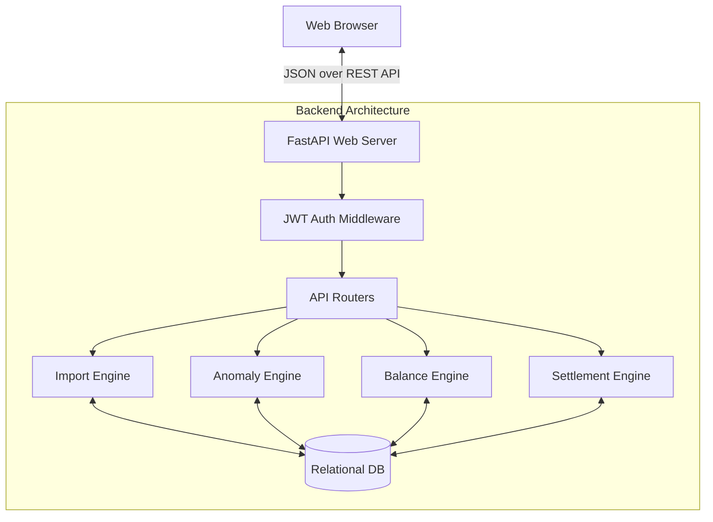

# BalanceIQ 🚀


> **Transform messy expense spreadsheets into trustworthy, explainable balances.**

BalanceIQ is a production-grade Shared Expense Management SaaS application. Unlike basic expense splitters, BalanceIQ features a powerful **CSV Import & Anomaly Resolution Engine** designed to handle messy real-world data (duplicate entries, ambiguous dates, mixed currencies, user overlaps) and computationally explain every single decision and balance derivation. 

---

## 📋 Assignment Documentation
To view the full details required for the assignment, please see:
*   **[SCOPE.md](SCOPE.md)**: Database Ledger Schema & CSV Anomaly log.
*   **[DECISIONS.md](DECISIONS.md)**: Architectural and Design decisions log.
*   **[IMPORT_REPORT.md](IMPORT_REPORT.md)**: Ingestion & Anomaly Resolution Report for `sample_expenses.csv`.
*   **[AI_USAGE.md](AI_USAGE.md)**: AI Assistance log, prompts, error detection, and corrections.

*   **[backend/README.md](backend/README.md)**: Backend-specific setup and API details.
*   **[frontend/README.md](frontend/README.md)**: Frontend-specific setup and component details.

---

## 🌟 Key Features

1. **Smart CSV Import Engine**: Upload raw, messy spreadsheets. The system automatically maps columns using fuzzy matching and handles structural inconsistencies.
2. **Intelligent Anomaly Detection**: A 9-stage pipeline that catches duplicates, negative amounts, mixed currencies, missing members, and settlement misclassifications before they corrupt the ledger.
3. **Full Mathematical Transparency**: Users never have to ask *"Why do I owe this?"* Every balance calculation is fully auditable, exposing the exact mathematical fractions and timeline of expenses that derived the final number.
4. **Membership Timeline Logic**: Handles dynamic groups where members join late or leave early. Expenses are strictly split only among active members at the time of the expense.
5. **Smart Settlement Optimization**: Uses graph-reduction algorithms to minimize the total number of transactions needed to settle all debts within a group.
6. **Premium SaaS Dashboard**: A stunning, responsive UI featuring rich micro-animations (Framer Motion), dark-mode glassmorphism, and instant UX feedback.

---

## 🏗️ High-Level Design (HLD)

BalanceIQ follows a standard modern Client-Server Architecture, decoupling the presentation layer from the heavy computational engines.



### Component Breakdown
1. **Frontend Application (Vite + React + TS)**: Manages state, routing, and UI rendering. Utilizes `@tanstack/react-query` for robust server-state caching and synchronization.
2. **API Gateway / Router (FastAPI)**: Exposes RESTful endpoints, handles request validation via Pydantic, and enforces JWT-based authentication.
3. **Core Business Logic Engines**: The brain of the application (detailed in LLD).
4. **Data Persistence (SQLAlchemy ORM)**: Manages structured, relational data ensuring ACID compliance for ledger operations.

---

## ⚙️ Low-Level Design (LLD)

### 1. Database Schema (Ledger Architecture)
The database is structured as an immutable-friendly ledger.
*   **Users**: System accounts.
*   **Groups**: Collections of users sharing expenses.
*   **GroupMembers**: Junction table defining **temporal memberships** (`joined_at`, `left_at`).
*   **Expenses**: The core ledger entry (Amount, Date, Currency, Payer).
*   **ExpenseParticipants**: Junction linking Expenses to Users with exact computed shares (handling uneven splits).
*   **Settlements**: Financial transfers resolving debts between two users.
*   **ImportSessions & ImportRows**: Temporary tables managing the state-machine of a CSV import before it is committed to the main ledger.

### 2. Core Business Engines
The backend logic is heavily modularized into pure engines to separate database reads from computation:

#### A. CSVEngine (`backend/app/engines/csv_engine.py`)
*   **Purpose**: Ingest raw bytes, guess encodings, and perform fuzzy string matching to map user columns to system expectations (e.g., mapping `"Cost (INR)"` -> `amount`).
*   **Tech**: Uses `pandas` for DataFrame manipulation and `rapidfuzz` for Levenshtein distance column mapping.

#### B. AnomalyEngine (`backend/app/engines/anomaly_engine.py`)
*   **Purpose**: Protect the ledger from bad data. 
*   **Pipeline**: Evaluates 9 strict rules over imported rows:
    1.  *Missing Fields* (No amount/date).
    2.  *Negative Amounts*.
    3.  *Zero Amounts*.
    4.  *Future Dates*.
    5.  *Duplicate Detection* (Same date, amount, and payer).
    6.  *Currency Mismatches*.
    7.  *Settlement Misclassification* (Expense labeled as settlement).
    8.  *Invalid Payers*.
    9.  *Membership Conflicts* (Expense date falls outside member's active timeline).

#### C. BalanceEngine (`backend/app/engines/balance_engine.py`)
*   **Purpose**: Calculate precise, explainable net balances.
*   **Mechanism**: Uses Python's `Decimal` to avoid floating-point errors. 
*   **Algorithm**: 
    1. Iterates over all `ExpenseParticipants`.
    2. Credits the Payer (`+amount`).
    3. Debits the Participants (`-share`).
    4. Applies `Settlements` to adjust net totals.
    5. **Explainability**: Generates a timeline of every operation that affected a user's net balance, returned as an audit trail.

#### D. SettlementEngine (`backend/app/engines/settlement_engine.py`)
*   **Purpose**: Graph algorithm to simplify debts.
*   **Algorithm**: 
    1. Separates users into `Debtors` (net < 0) and `Creditors` (net > 0).
    2. Sorts both lists.
    3. Greedily matches the largest debtor with the largest creditor.
    4. Generates a list of suggested transactions (`User A pays User B $50`) minimizing total transaction edges.

---

## 🔄 The Import Workflow State Machine

The flagship feature of BalanceIQ is the multi-step CSV import. It prevents "garbage in, garbage out" through a strict state machine:

1. **`UPLOADED`**: Raw CSV ingested, columns guessed. User approves column mappings.
2. **`MAPPED`**: Data parsed into rows. System extracts unique names. User maps unique names to existing DB Users or creates new ones, defining their active timeline.
3. **`MEMBERSHIP_RESOLVED`**: `AnomalyEngine` runs across the mapped data.
4. **`ANOMALIES_DETECTED`**: Execution is paused. User must manually resolve each anomaly (Keep, Skip, Auto-Fix).
5. **`READY_TO_EXECUTE`**: All anomalies resolved.
6. **`COMPLETED`**: `BalanceEngine` dry-runs the math, and if successful, atomic DB transactions commit the rows to `Expenses` and `Settlements`.

---

## 💻 Tech Stack

**Frontend:**
*   **Framework**: React 18 + Vite + TypeScript
*   **Styling**: Tailwind CSS + custom glassmorphism utilities
*   **Animations**: Framer Motion
*   **State Management**: TanStack React Query (Server state) + React Context (Local Auth state)
*   **Icons**: Lucide React

**Backend:**
*   **Framework**: FastAPI (Python 3.12+)
*   **Database ORM**: SQLAlchemy 2.0 + Alembic (Migrations)
*   **Data Processing**: Pandas, Rapidfuzz
*   **Authentication**: JWT (JSON Web Tokens), Passlib, Bcrypt
*   **Architecture**: RESTful APIs, Pydantic Schema Validation

---

## 🚀 Setup & Local Development

### Prerequisites
*   Node.js (v18+)
*   Python (3.11+)
*   Git
*   Docker & Docker Compose (Optional, for containerized setup)

### 🐋 Run with Docker Compose (Recommended)
The easiest way to run the entire stack locally is using Docker Compose.

```bash
# Build and start the containers in detached mode
docker-compose up -d --build
```
- **Frontend** will be available at: `http://localhost`
- **Backend API** will be available at: `http://localhost:8000`
- **API Docs** will be available at: `http://localhost:8000/docs`

To view logs or stop the services:
```bash
docker-compose logs -f
docker-compose down
```

---

### 💻 Manual Local Setup

### 1. Backend Setup
Open a terminal and navigate to the backend directory:
```bash
cd backend

# Create a virtual environment
python -m venv venv

# Activate the virtual environment
# On Windows:
venv\Scripts\activate
# On macOS/Linux:
# source venv/bin/activate

# Install dependencies
pip install -r requirements.txt

# Start the FastAPI Server (Runs on http://localhost:8000)
uvicorn app.main:app --reload
```

*Note: By default, the backend uses a local SQLite database (`balanceiq.db`). Tables are created automatically on startup.*

### 2. Frontend Setup
Open a second terminal and navigate to the frontend directory:
```bash
cd frontend

# Install Node dependencies
npm install

# Start the Vite Development Server (Runs on http://localhost:5173)
npm run dev
```

### 3. Usage
1. Open your browser to `http://localhost:5173`.
2. Click **Get Started** and create a new account (or login).
3. Create a **New Group** from the dashboard.
4. Navigate to the group and click **Import CSV**.
5. Upload the provided `sample_expenses.csv` (located in the project root) to test the Anomaly Engine and smart mapping!

---

## 🛡️ License & Contact
Developed as a production-grade demonstration of full-stack engineering, complex algorithmic state management, and modern UI/UX design.
