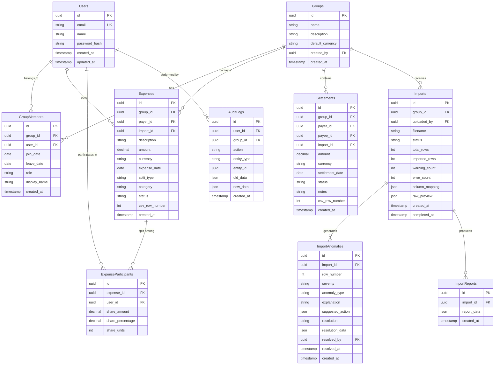

# SCOPE.md — Database Schema & Anomaly Log

This document outlines the database ledger schema for **BalanceIQ** and details the data quality issues (anomalies) identified in the sample expense dataset (`sample_expenses.csv`) and how the system handles them.

---

## 1. Database Schema

BalanceIQ uses a relational database schema designed to act as a financial ledger. All transactions and balances are computed dynamically from immutable ledger entries, ensuring auditing capabilities.

### Entity Relationship Diagram (ERD)

---

## 2. Anomaly Log (Dataset Issues & Handling)

We analyzed the `sample_expenses.csv` dataset and mapped out each anomaly type detected by our `AnomalyEngine`, as well as how they are resolved:

| CSV Row | Field / Issue | Anomaly Type | Severity | Handling & Resolution Strategy |
|---------|---------------|--------------|----------|--------------------------------|
| **6** | Duplicate of Row 5: same description ("Dinner at restaurant"), amount (3200), date (15/02/2024), and payer (Rohan). | `duplicate` | Warning | **Skip / Merge**: User chooses to keep only the first entry (`keep_first`), ignoring the second duplicate row. |
| **8** | Date format is "25-Feb-2024" instead of "DD/MM/YYYY". | `date_fuzzy` | Info | **Auto-Normalization**: The `CSVEngine` automatically standardizes this to a standard ISO date string (`2024-02-25`). |
| **10** | Description: "Rohan paid Aisha", Category: "Settlement". Paid by Rohan, split with Aisha. | `settlement_detected` | Info | **Settlement Reclassification**: The engine flags this as a settlement. It is stored in the `Settlements` table rather than the `Expenses` ledger, correcting the net ledger. |
| **13** | Amount is negative (`-500`) for groceries. | `negative_amount` | Warning | **Refund / Positive Conversion**: User can choose to convert the amount to positive and flip payer/payee, or skip the record, or keep as negative (refund). Default action: convert to positive (`convert_positive`). |
| **15** | Description: "Priya settled with Aisha", Category: "Settlement". | `settlement_detected` | Info | **Settlement Reclassification**: The engine stores this as a debt-resolution settlement instead of an expense. |
| **16** | Payer is "Dev" (who was not in the group originally). | `unknown_user` | Warning | **Auto-Add / Timeline Registration**: The system suggests adding Dev to the group with a join date matching the first appearance (`14/04/2024`). |
| **17** | Participant "Sam" appears. Date 16/04/2024. | `unknown_user` | Warning | **Auto-Add / Timeline Registration**: Sam is added to the group with a join date matching the first appearance. |
| **20** | Amount is `0` for groceries. | `zero_amount` | Warning | **Skip / Acknowledge**: A zero-cost expense has no ledger impact. Default action is to `skip` the row during ingest. |
| **21** | Amount is `$300` (mixed currencies, USD vs INR). | `mixed_currencies` | Info | **Per-Currency Ledgers**: BalanceIQ calculates balances in isolated currencies (USD, INR). Cross-currency simplification uses static conversion rates. |
| **22** | Date is "InvalidDate", Amount is "abc", Payer is "Unknown". | `date_ambiguous` & `invalid_amount` & `unknown_user` | Error | **Block & Input Required**: Critical parsing failures. This row cannot be imported unless resolved manually via the import wizard (`manual_fix`) or skipped entirely (`skip`). |
